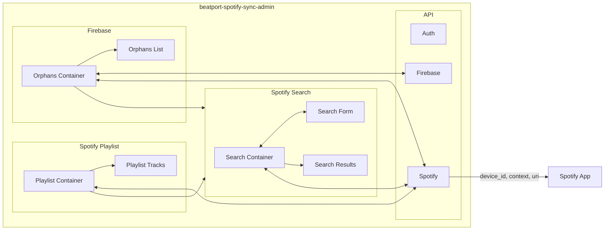

# beatport-spotify-sync-admin

Welcome to the most niche app of all time.

[View playlist on Spotify](https://open.spotify.com/playlist/6WyKo6Zejscls8G676N8UX?si=b00bbb223db044cc)

[beatport-spotify-sync](https://github.com/puglyfe/beatport-spotify-sync)

This app allows me manage my playlist that is auto-populated with purchases from Beatport. This helps me address 2 specific situations:

1. An incorrect version of a track was added (Radio Mix, radio show, incorrect remix, etc.)
1. A track was unable to be located via the Spotify API (artist name formatting, different release date, etc.)

## Getting Started

First, run the development server:

```bash
npm run dev
```

Open [http://localhost:3000](http://localhost:3000) with your browser to see the result.

## Architecture


